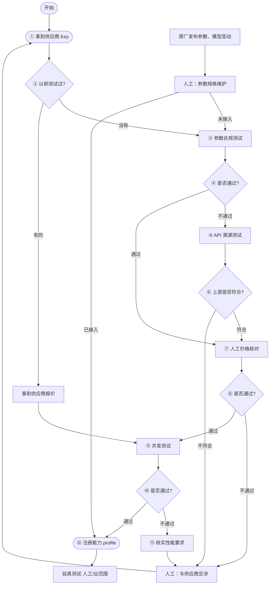

# Plan: 将 yibuapi-llm-loadtest 改造为 openclaw skill `llm-api-test`

## 目标

把 `/home/wangzhouhao/projects/yibuapi-llm-loadtest`（多供应商 LLM 参数/缓存/压测控制台，Flask web console + 任务脚本）重新打包为一个 openclaw skill。安装后：

1. openclaw 能 host 起 web console 前端（用户可在浏览器修改和操作）。
2. 用户可通过 openclaw 自然语言下令：对某 provider + 某 model 跑参数测试 / 缓存测试 / 图片参数测试 / 压测。
3. 测试结束后 openclaw 读取结果 JSON（verdict/summary）并总结报告。
4. agent 直接跑脚本发起的任务，前端也能看到运行中状态和历史结果。
5. **供应商准入工作流内置于 skill**：openclaw 记住完整业务流程（mermaid 状态机），既可从头执行新供应商准入，也可中途接手任一进行中实例。

## 已确认的决策

| 决策点 | 结论 |
|---|---|
| 代码获取 | **复制（vendor）进 skill**，skill 自包含；与原仓库脱钩 |
| 密钥/私有供应商 | **skill 数据目录** `~/.config/llm-api-test/`（`.env` + `providers.local.yaml`），不进 skill 包；setup 时可从原仓库复制初始版本 |
| 测试范围 | **全部保留**：param_test、cache_suite、image_param_test、quick_load/staircase/soak |
| agent 调用方式 | **直接跑脚本**（env 注入），前端可见运行中任务与历史 → 共享任务注册机制（补丁 P2） |
| 安装 | 提供 **openclaw 可自行执行的安装命令 + 提示词**（README 中给出） |
| 前端监听 | 保持原仓库默认 **0.0.0.0:8090**（局域网开放，无鉴权；README 风险说明 + `WEB_CONSOLE_HOST` 可改） |
| 溯源测试定位 | 判断 token 的**上游来源供应商**（如 Claude 可由官方/AWS/Vertex 供货），在 model family 之上；用 `lib/upstream_fingerprint.py` 指纹比对实现 |
| 验真测试 | **出范围**，不属于本 skill（流程图中标注为人工后续事项，不自动化） |
| 工作流实例粒度 | **provider + model** 一条实例，状态文件 `workflows/<provider>__<model>.json` |
| ⑫ 接入/更新数据库 | = 在本项目**注册模型能力 profile**（写入 `model_capability_profiles.local.yaml` 覆盖层），遵循 `modality → family → route profile → API form → model profile` 层级（schema v4）；**写入必须经人工明确批准** |

## 源仓库关键事实（已核实，实现时依赖）

- `scripts/web_console.py`：Flask 应用；`main()`（3118-3124 行）**已支持** `WEB_CONSOLE_HOST` / `WEB_CONSOLE_PORT`（默认 0.0.0.0:8090）→ 不需要端口补丁，console.sh 直接用这两个变量。
- 任务 API：`POST /api/jobs`、`GET /api/jobs`、`GET /api/jobs/<id>`、`POST /api/jobs/<id>/stop`、`GET /api/results`、`GET /reports/<path>`。
- 任务通过 env 启动子进程（`_start_locked`，993-1021 行）：`LOADTEST_PROVIDER / LOADTEST_MODEL / LOADTEST_API_FORM / LOADTEST_ROUTE_PROFILE / LOADTEST_WORKLOAD / LOADTEST_REPORT_DIR / LOADTEST_JOB_SPEC / LOADTEST_TIMEOUT_SEC / LOADTEST_TARGET_RPM/TPM / LOADTEST_REQUEST_MODE / LOADTEST_PARAM_TEST_RUNS / LOADTEST_TOOL_VALIDATION_MODE / LOADTEST_REFERENCE_SOURCE / LOADTEST_CACHE_MEASURED_REQUESTS`，子进程 `start_new_session=True`。
- 任务类型 → 命令映射（`_command_for_job`，1652-1679 行）：param_test→`scripts/param_test.py`，cache_suite→`scripts/run_cache.py`，staircase→`run_staircase.py`，soak→`run_soak.py`，quick_load→`python -m locust -f locustfile.py --headless ...`；image_param_test 走 `_image_command_for_job`（带 `--base-url/--provider/--api-key-env/--model` 等 CLI 参数）。
- 任务产物统一在 `reports/jobs/<job_id>/`：`job_spec.json`、`stdout.log`、`verdict.json`（param/cache）、`summary.json`+`plan.json`+`case_results.json`（image）、`load_result.json`+locust csv/html（压测）。
- job_id 格式（`_new_job_id`，2492 行）：`{UTC stamp %Y%m%dT%H%M%SZ}_{job_type}_{provider}_{model}_{uuid8}`，非 `[A-Za-z0-9_.-]` 替换为 `_`。
- `_job_type_from_report_dir`（2369 行）：优先读 `job_spec.json` 的 `type`，否则按目录名中 `_param_test_` 等子串判断 → wrapper 只要写规范的 `job_spec.json` 即被识别。
- 历史恢复：`_load_finished_jobs()`（732 行）**只在 JobManager 启动时**扫描 `JOBS_ROOT` → 运行中的 console 看不到外部新任务，必须打 P2。
- **`lib/job_spec.py` 可直接复用**：`make_job_spec()`（629 行）、`resolve_cache_plan/staircase_plan/soak_plan/image_plan`、`validate_workload`、`resolve_request_mode`、`load_job_spec`。
- 密钥注入：`lib/credential_security.py` 的 `build_provider_child_env(config, provider, extra_env)`（web_console.py:994 同款用法）。
- 密钥路径硬编码：`lib/config.py:18` `LOCAL_PROVIDERS_PATH = PROJECT_ROOT/"providers.local.yaml"`；`lib/config.py:107` `.env` 默认 `PROJECT_ROOT/".env"`，`os.environ.setdefault` 加载 → P1 补丁点。
- `config.yaml` **不含密钥**（只有 `api_key_env` 变量名），可安全 vendor；`providers.local.yaml` / `.env` / `reports/` 必须排除。
- 依赖很轻：`requirements.txt` = locust + PyYAML + requests + Flask；`requirements-image.txt` 可选。
- `tests/` 有 pytest 用例（test_job_spec.py、test_credential_security.py、test_image_console.py 等）→ vendor 并用于补丁回归。
- Python 3.11+ 硬性要求（`datetime.UTC`）。
- openclaw skill 格式参考 `~/projects/clawbots/workspace/skills/searxng`：`SKILL.md` frontmatter（name/description/triggers/metadata.clawdbot）、`{baseDir}` 占位、`_meta.json`、`references/`。
- `lib/upstream_fingerprint.py`：`collect_fingerprint(config, provider, model)`（194 行，发 4 个探针：非流式/流式/非法 temperature/非法 model）+ `compare_fingerprints(fp, candidate)`（279 行，按 node_hash/id_prefix/usage_keys/stream_structure/error_structure 等加权打分）+ `load_corpus(path)`。**但指纹语料库 `fixtures/upstream_fingerprints.json` 在仓库中不存在，且无任何脚本调用该 lib** → 需新建 `trace_test.py` 入口并把语料库放数据目录，首次使用需先采集已知上游（官方/AWS/Vertex 等）的参考指纹。
- 能力 profile 注册表：`model_capability_profiles.yaml`（schema v4，层级 `modalities → text/image → families → route_profiles → api_forms → model_profiles`，含 `suite/pressure_profiles/models/reference_sources` 等字段）；本地覆盖层路径常量在 `lib/reference_specs.py`（`CAPABILITY_PROFILES_PATH` / `LOCAL_CAPABILITY_PROFILES_PATH`）→ P1 需加覆盖。
- `lib/job_spec.py` 的 `SUPPORTED_JOB_TYPES`（29 行）不含 trace_test → P4 补丁加入。

## Skill 目录结构（在 `/home/wangzhouhao/projects/API_param_test_skill/` 下构建）

```text
llm-api-test/
├── SKILL.md                  # frontmatter + agent 操作指令（中文，含工作流驱动说明）
├── _meta.json
├── README.md                 # 安装命令 + 给 openclaw 的安装提示词 + 0.0.0.0 风险说明
├── app/                      # vendored 原仓库代码
│   ├── scripts/  lib/  fixtures/  tests/  locustfile.py
│   ├── scripts/trace_test.py # 【新增】API 溯源测试入口（见下）
│   ├── workflow.yaml         # 【新增】供应商准入工作流状态机（机器可读）
│   ├── config.yaml  model_capability_profiles.yaml  api_reference_specs.yaml
│   └── requirements.txt  requirements-image.txt
├── scripts/
│   ├── setup.sh              # 校验 python3.11、建 venv、装依赖(+pytest)、初始化数据目录
│   ├── console.sh            # start|stop|status|url — 后台守护 web console
│   ├── run_test.py           # agent 入口：注册任务 + env 注入 + 直接跑脚本 + 退出码
│   ├── jobs.py               # list/status：扫描 reports/jobs，输出 JSON
│   ├── result.py             # 读取某 job 结果，打印精简 JSON 供 agent 总结
│   └── workflow.py           # 【新增】工作流实例管理：start/status/list/advance/next/onboard
└── references/
    ├── testing-guide.md              # 从原仓库 docs/ 精简：测试类型、判读要点、阈值
    └── supplier-onboarding-workflow.md  # 【新增】mermaid 流程图 + 逐节点说明 + 脚本映射
```

数据目录（运行时生成，不进 skill 包）`~/.config/llm-api-test/`：
`.env`、`providers.local.yaml`、`model_capability_profiles.local.yaml`（onboard 批准后的注册表覆盖层）、`upstream_fingerprints.json`（溯源语料库）、`console.pid`、`console.log`、`reports/jobs/...`、`workflows/<provider>__<model>.json`（工作流实例状态）。

## 补丁（只改 vendored 副本）

### P1 — 配置/报告路径外置（`app/lib/config.py` + `app/scripts/web_console.py`）

- a. `load_dotenv`：优先 `LLM_API_TEST_DOTENV`，缺省保持 `PROJECT_ROOT/.env`。
- b. `LOCAL_PROVIDERS_PATH`：模块加载时优先 `LLM_API_TEST_PROVIDERS_LOCAL`。
- c. `REPORTS_ROOT`/`JOBS_ROOT`（web_console.py:85-86）及各 run_* 脚本的 `LOADTEST_REPORT_DIR` 缺省：优先 `LLM_API_TEST_REPORTS_DIR`，缺省 `~/.config/llm-api-test/reports`。
- d. `lib/reference_specs.py` 的 `LOCAL_CAPABILITY_PROFILES_PATH`：优先 `LLM_API_TEST_PROFILES_LOCAL`（指向数据目录的 `model_capability_profiles.local.yaml`）→ onboard 注册的 profile 落数据目录，不污染 skill 包。
- wrapper 与 console.sh 统一 export 这些变量指向数据目录。

### P2 — 外部任务发现与管控（`app/scripts/web_console.py`，~100-150 行）

- wrapper 在任务目录写 `run.json`：`{"pid", "pgid", "type", "provider", "model", "started_at", "returncode": null, "finished_at": null}`；结束时回填 `returncode/finished_at`。
- `JobManager` 增加 `_discover_external_jobs()`：扫描 `JOBS_ROOT` 中不在内存的目录；有 `run.json` 且 `returncode is null` 且 pid 存活（`os.kill(pid,0)` + `/proc/<pid>/cmdline` 含对应脚本名校验，防 pid 复用）→ 注册为 running 任务（process 句柄为空，用 monitor 线程轮询 pid）；pid 退出后按 `returncode` + verdict/summary 判 completed/failed，之后与 `_load_finished_jobs` 路径一致。
- 在 `GET /api/jobs` 和 `GET /api/jobs/<id>` 处理函数入口（加锁、幂等）调用 `_discover_external_jobs()`。
- `POST /api/jobs/<id>/stop` 扩展：外部任务用 `os.killpg(pgid, SIGTERM)`（wrapper 同样 `start_new_session=True`），与现有 stop 语义对齐。

### P3 — 无需端口补丁

`main()` 已支持 `WEB_CONSOLE_HOST`/`WEB_CONSOLE_PORT`；console.sh 默认 export `0.0.0.0:8090`（用户决策），README 说明风险与改法。

### P4 — trace_test 任务类型（`app/lib/job_spec.py` + `app/scripts/web_console.py`）

- `SUPPORTED_JOB_TYPES` 增加 `"trace_test"`；`_job_type_from_report_dir` 名称回退增加 `_trace_test_` 子串。
- console 对 trace_test 走通用恢复路径（verdict.json 含 provider/model/model_family/pass），无需专用 UI。

## 供应商准入工作流（本计划核心新增）

### 流程图（用户提供，验真节点出范围）



### 节点 → 实现映射

| 节点 | 类型 | 实现 |
|---|---|---|
| ① 拿到供应商 Key | 人工门 | agent 引导用户提供 base_url/key/模型清单，协助写入数据目录 `.env` + `providers.local.yaml`（写前展示 diff 并确认） |
| ② 以前测试过? | 自动 | `workflow.py list` + 扫 reports 历史判定 |
| ③ 参数合规测试 | 自动 | `run_test.py --type param_test`；④ 判定读 `verdict.json` 的 `pass` |
| ⑤ API 溯源测试 | 自动 | `run_test.py --type trace_test`（新）；⑥ 判定读 verdict 的 `best_match` 与用户宣称上游是否一致 |
| ⑦ 人工价格核对 | 人工门 | 用户提供报价与结论；`workflow.py advance` 记录 quote/notes/outcome |
| ⑨ 并发测试 | 自动 | `run_test.py --type staircase`；⑩ 判定读 `load_result.json`/verdict |
| ⑪ 核实性能要求 / 交涉 | 人工门 | 记录结论；交涉后回到 ①（允许更新 key/配置） |
| 参数规格维护 | 人工门 | 原厂模型变动触发；未接入→③，已接入→⑫ |
| ⑫ 注册能力 profile | 半自动 | `workflow.py onboard-propose` 依据③⑤⑨ 的产物生成 v4 YAML 提案（modality→family→route_profile→api_form→model_profiles，含 evidence/reference_sources）→ **人工批准** → `onboard-apply` 合并进数据目录 `model_capability_profiles.local.yaml` |
| 验真测试 | 出范围 | 文档标注为人工后续事项，不自动化 |

### 新组件

- **`app/workflow.yaml`**：状态机机器可读定义——节点 id、类型（`auto_test`/`human_gate`/`decision`/`terminal`）、迁移边（含条件取值）、auto 节点对应的 run_test.py 命令模板、decision 节点的判定来源（verdict.json 字段路径）。
- **`scripts/workflow.py`**：
  - `start --provider P --model M`：建实例（`workflows/P__M.json`：`{current_node, history[], job_ids{}, human_gates{}, created_at, updated_at}`），幂等（已存在则提示用 status/next 接手）；
  - `status` / `list`：当前节点、历史、待办人工门、建议下一步——**中途接手的入口**（agent 被要求“接着测 X”时先跑这个）；
  - `next`：打印当前节点动作；auto_test 节点输出完整可执行命令（含 `--background` + 轮询 + result 总结指引），human_gate 节点输出需要向用户提的问题；
  - `advance --outcome <值> [--notes ...] [--job-id ...]`：记录判定/人工结论并迁移到下一节点（decision 节点可由 agent 在读完 result.py 后调用，也可 `--auto` 从最近 job 的 verdict 推导）；
  - `onboard-propose`：汇总实例内 param/trace/staircase 产物，生成 profile 注册 YAML 提案并打印（不落盘）；`onboard-apply --yes`：**仅当用户明确批准**，合并进 `model_capability_profiles.local.yaml`（数据目录），并校验 schema v4 结构后备份原文件。
- **`app/scripts/trace_test.py`**（~150 行）：
  - `compare --provider P --model M [--expect <上游名>]`：`collect_fingerprint` → 与语料库逐个 `compare_fingerprints` → 写 report 目录 `verdict.json`：`{pass, best_match, best_score, expected, match_expected, per_candidate_scores, evidence_summary}`；
  - `collect --provider P --model M --save-upstream <名字>`：采集已知上游参考指纹，追加进数据目录语料库 `upstream_fingerprints.json`（env `LLM_API_TEST_UPSTREAM_CORPUS` 可覆盖路径）；
  - **语料库引导**：仓库不带语料；README/SKILL.md 说明先用官方/AWS/Vertex 直连 key 跑 `collect --save-upstream` 建参考，才能做 compare。
- `run_test.py` 增加 `--type trace_test` → 调 `trace_test.py compare`，任务注册/run.json 与其他类型一致（配合 P4，前端可见）。

## 包装脚本行为

- `run_test.py --type param_test|cache_suite|image_param_test|quick_load|staircase|soak --provider P --model M [--route-profile R --api-form F --reference-source S --runs N --workload W --users U --duration D ...]`：
  1. `load_config()`（经 P1 读数据目录配置），复用 `lib/job_spec.py` 的 resolve/validate/`make_job_spec` 构建 job_spec；
  2. 用与 `_new_job_id` 相同格式建 `$REPORTS/jobs/<job_id>/`，写 `job_spec.json` + `run.json`；
  3. `build_provider_child_env(...)` 注入密钥 + 全套 `LOADTEST_*` env（与 `_start_locked` 对齐）；
  4. `subprocess.Popen(..., start_new_session=True)` 跑对应命令（映射逻辑复刻 `_command_for_job`/`_image_command_for_job`），stdout 同时写 `stdout.log` 并透传；
  5. 结束回填 `run.json`，以子进程退出码退出；支持 `--background`（打印 job_id 即返回，供 agent 异步发起后轮询）。
- `jobs.py [--running] [--id JOB_ID]`：扫 `reports/jobs`，结合 `run.json` pid 存活状态输出 JSON（id/type/provider/model/status/created_at/progress 概要）。
- `result.py --id JOB_ID`：按类型打印精简 JSON —— param_test：pass、supported/unsupported parameters、失败用例摘要；cache_suite：pass、缓存命中指标（read/write 命中率、节省 tokens）；image：summary + 每 case 尺寸/格式判定；压测：load_result 的 RPM/TPM/percentile/错误率。供 agent 直接中文总结。
- `console.sh start`：`nohup` + 数据目录 pid/log；`status` 查 pid + HTTP 探活 `/api/config`；`url` 打印访问地址。

## SKILL.md 要点

- frontmatter：`name: llm-api-test`；description 覆盖“LLM 供应商准入工作流 + 参数/缓存/图片/压测 + API 溯源”；triggers（"参数测试"、"缓存测试"、"压测"、"param test"、"cache test"、"测试供应商"、"新供应商接入"、"继续测试"、"溯源" 等）；`metadata.clawdbot.requires.bins: ["python3", "bash"]`。
- 正文分两层：
  1. **工作流模式**（默认）：用户说“测试新供应商 X 的模型 M”→ `workflow.py start` 后循环 `next` → 执行/询问 → `advance`；用户说“接着测 X”→ `workflow.py status` 接手。每步完成后向用户简报当前处于流程图哪个节点。
  2. **单点测试模式**：直接对某 provider+model 跑某类测试（run_test.py 各类型调用模板、`--background` + jobs.py 轮询 + result.py 总结闭环），不进入工作流。
- 约束：测试真实调用付费 API，执行前向用户确认 provider/model/类型；**onboard-apply 与写 `.env`/`providers.local.yaml` 必须用户明确批准**；停止任务用 console stop 或 kill run.json pid。

## 安装命令与提示词（写入 README.md）

- 安装命令（供 openclaw 执行）：复制 `llm-api-test/` 到 openclaw workspace skills 目录 → `bash scripts/setup.sh`（幂等；检测 python3.11，优先 uv 否则 venv+pip；可选 `--from /home/wangzhouhao/projects/yibuapi-llm-loadtest` 复制初始 `.env`/`providers.local.yaml`/语料库）→ `bash scripts/console.sh start`。
- 提示词：一段可粘贴给 openclaw 的中文指令，让它完成安装、启动 console 并汇报前端 URL。

## 实施任务清单

1. 复制原仓库到 `llm-api-test/app/`。**排除**：`.git`、`__pycache__`、`.venv`、`reports/`、`.env`、`providers.local.yaml`、`*.local.yaml`、`docs/`（精简后进 references）。
2. P1 补丁（a-d 配置/报告/注册表路径外置）→ 单测：设 `LLM_API_TEST_*` 后 `load_config()` 与 profile 加载读到数据目录。
3. 写 `scripts/setup.sh`、`console.sh`。
4. 写 `scripts/run_test.py`（含 trace_test 类型）、`jobs.py`、`result.py`。
5. 写 `app/scripts/trace_test.py`（compare/collect 两模式）+ P4 补丁（SUPPORTED_JOB_TYPES）。
6. P2 补丁（外部任务发现 + stop）→ 跑 vendored `tests/`（pytest）回归 + 手动验证：console 运行中用 `run_test.py --background` 发起任务，`GET /api/jobs` 见 running → completed，前端 stop 可终止外部任务。
7. 写 `app/workflow.yaml` + `scripts/workflow.py`（start/status/list/next/advance/onboard-propose/onboard-apply）。
8. 写 `SKILL.md`、`_meta.json`、`README.md`、`references/testing-guide.md`、`references/supplier-onboarding-workflow.md`（含 mermaid 图源码）。
9. 端到端验证：
   - `setup.sh` 全新跑通；`console.sh start` 后 `/api/config` 探活、前端可选手动发任务；
   - `run_test.py` 对某已配置 provider+model 跑 param_test（低 runs）与 cache_suite，`result.py` 输出正确；
   - 前端能看到 run_test 发起任务的运行中与历史状态；
   - **工作流演练**：`workflow.py start` 新实例 → 走到③自动发 param_test → ④ advance → 人工门暂停 → 模拟批准 → ⑫ onboard-propose 输出提案、onboard-apply 落数据目录；再用第二个会话 `workflow.py status` 验证中途接手；
   - 报告/状态/注册表均落数据目录，skill 目录无密钥/状态残留。
10. 无可用 API key 时的降级验证：setup、console 启动、API 探活、`load_config` 加载、pytest、workflow.py 状态机干跑（auto 节点只打印命令不执行可用 `--dry-run`）。

## 风险与注意

- **密钥泄漏**：复制与打包必须排除 `.env`、`providers.local.yaml`、`reports/`；README 强调；setup 复制配置时 `chmod 600`。
- **0.0.0.0 无鉴权**（用户已确认）：局域网任何人可发起付费测试；README 给 `WEB_CONSOLE_HOST=127.0.0.1` 改法。
- **付费 API**：SKILL.md 要求 agent 执行前与用户确认；沿用原仓库 `minimum_prompt_tokens` 等安全口径。
- **人工批准红线**：写 `.env`/`providers.local.yaml`/`model_capability_profiles.local.yaml` 前必须展示内容并获明确批准；`onboard-apply` 无 `--yes` 不执行。
- **溯源语料库为空**：未先 `collect --save-upstream` 建参考时 compare 无意义 → trace_test 在语料为空时明确报错并提示建库步骤。
- **P2 并发/幂等**：发现逻辑加锁、同目录不重复注册；pid 复用用 `/proc` cmdline 校验。
- **工作流状态兼容**：`workflow.yaml` 带 `version` 字段；实例状态文件带 `workflow_version`，不匹配时 `status` 提示迁移/重建。
- **Python 3.11**：setup.sh 显式校验版本，不满足即报错退出。
- 出范围：clawhub 发布、前端 UI 重构、验真测试自动化、真实业务数据库对接、与原仓库的持续同步机制。
