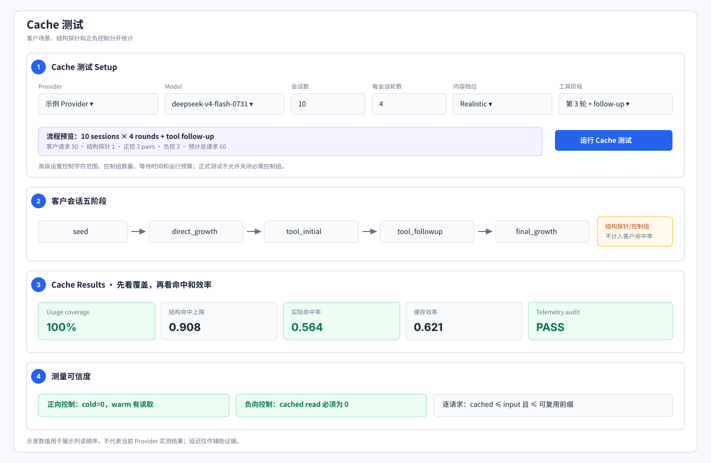

# 缓存测试说明

返回[测试总指南](testing_guide.md)。

缓存测试验证三件事：真实增长会话是否产生可复用前缀、供应商是否真的上报缓存使用、上报数字是否经得起正负控制和结构上限审计。

“第二次更快”不是缓存证据；只有官方响应 usage 中的 cache token 字段才能产生数值结论。

## 默认场景

正式默认场景是 `progressive_customer_session`：

- 短固定 system。
- 每个独立会话有唯一首部，避免跨会话污染。
- 会话按轮次 append-only 增长。
- assistant、变化 user、真实工具调用和唯一 tool result 都进入历史。
- 所有会话先完成 seed，统一等待后再交错推进。
- 每次运行从首个可缓存语义 token 注入 run nonce，隔离历史运行。

默认基础配置是 10 个会话 × 4 轮，工具在第 3 轮增加 follow-up；再加结构探针、3 组正向控制和 3 个负向请求，约 60 个请求。控制台会在启动前展示精确预算。

客户会话的五个阶段分别是 `seed`、`direct_growth`、`tool_initial`、`tool_followup`、`final_growth`。报告会按阶段拆分理论上限、实际命中率和效率；某一阶段失败不能被其他阶段的高命中率掩盖。



图中编号对应：① 客户场景与预算设置；② 五个客户会话阶段；③ usage 覆盖、结构上限、实际命中率和效率；④ 正负控制及逐请求 telemetry 审计。示意数值不代表当前供应商实测结果。

`kilocode_agent_session`、`growing_conversation`、`shared_prefix` 是诊断场景，不应与默认客户场景混用口径：

- `kilocode_agent_session`：大 system + 工具 schema + 多步 agent/tool result，观察长轨迹复用。
- `growing_conversation`：逐轮增长对照，便于定位命中单调性。
- `shared_prefix`：固定长前缀的简化实验。

## 四组流量必须分开

| 分组 | 作用 | 是否进入客户命中率 |
|---|---|---|
| 客户会话 | 模拟实际增长对话 | 是 |
| 结构探针 | 独立估算每轮理论可复用前缀 | 否 |
| 正向控制 | 同长前缀 cold→warm，证明缓存机制存在 | 否 |
| 负向控制 | 唯一随机首部，验证不应命中时不会虚报 | 否 |

缺少正向或负向控制时，不能给出“缓存统计可信”的结论。正向控制失败可能表示缓存不存在、路由不稳定或缓存门槛未达到；负向控制偏高通常表示聚合路由污染、隐藏注入或 cached token 统计不诚实。

## 三个核心指标

```text
structural_hit_rate_ceiling
= Σ structurally_cacheable_prefix_tokens / Σ input_tokens

actual_cache_hit_rate
= Σ provider_cached_input_tokens / Σ input_tokens

cache_efficiency
= actual_cache_hit_rate / structural_hit_rate_ceiling
```

- `structural_hit_rate_ceiling`：按真实请求结构估算的理论上限，不是供应商上报值。
- `actual_cache_hit_rate`：客户请求中供应商官方上报的 cached input tokens 占比。
- `cache_efficiency`：实际命中相对理论可复用上限的实现程度。

`cache_efficiency > 100%` 不应被截成 100%；报告保留原值并标记 `exceeds_structure`，因为这可能意味着 usage 超报、代理注入污染或结构估算不一致。

另外要看：

- `cache_measurement_coverage`：成功客户请求中有官方 cache 字段的比例。
- `cache_hit_request_ratio`：报告命中的请求比例，不等于 token 命中率。
- `session_completion_ratio`：会话是否真的走完整条轨迹。
- `tool_flow_supported_session_ratio`：工具阶段是否被模型正常支持。
- `cache_usage_accuracy_status`：逐请求和控制组审计结果。

## 官方 usage 的归一化

不同 API 可能在不同位置报告缓存，例如：

- OpenAI 兼容：`usage.prompt_tokens_details.cached_tokens`。
- DeepSeek 风格：`usage.prompt_cache_hit_tokens` / `prompt_cache_miss_tokens`。
- Claude：`cache_creation_input_tokens` / `cache_read_input_tokens`。
- Gemini：按当前 Route 和官方 schema 读取对应 cached content/token 字段。

执行器会统一为 cached/uncached input tokens，但仍保留原始 usage。每条记录检查：

- `0 ≤ cached ≤ input`。
- cached + uncached 与 input 的算术一致性。
- cached 不超过该请求真实可复用前缀。
- 正控 warm 相比 cold 有增长，且不超过 cold 的输入上限。
- 负控命中率不超过配置上限。

字段缺失时指标是 N/A，不允许从延迟反推数值。

## Observe 与 Gate

默认 `thresholds.cache.mode=observe`：普通命中率或性能没有达到目标时仍可完成流程，适合先建立基线。

但 observe 不会放过数据造假或自相矛盾。以下情况任何模式都应阻断：

- cached tokens 为负数或超过 input。
- hit/miss 算术不成立。
- cached 超过结构可复用上限。
- 强制控制组缺失。
- 控制组存在明确的 telemetry 矛盾。

启用 `gate` / `hard_fail` 前，应显式设置客户命中目标、测量覆盖率、正向控制最小值和负向控制最大值。不存在适合所有模型家族与 Route 的统一缓存门槛。

## 如何运行

推荐从 Web 控制台选择 Provider、Model、Route 和 API Form，再配置会话数、轮数、内容档位和工具阶段：

```bash
python scripts/web_console.py
```

直接运行当前配置：

```bash
LOADTEST_PROVIDER=<provider> \
LOADTEST_MODEL=<model> \
LOADTEST_ROUTE_PROFILE=<route> \
LOADTEST_API_FORM=<api-form> \
python scripts/run_cache.py
```

复现 Web Job 的不可变配置快照：

```bash
LOADTEST_JOB_SPEC=reports/jobs/<job_id>/job_spec.json \
LOADTEST_REPORT_DIR=reports/jobs/<job_id> \
python scripts/run_cache.py
```

`run_cache.py` 没有 argparse `--help`；它读取环境变量、Job Spec 或 `config.yaml`。

## 结果阅读顺序

1. `job_spec.json`：确认 model/family/route/API Form/profile 与有效 cache plan。
2. `cache_results.json`：其中 `summary` 保存客户、结构、正控、负控和分阶段指标。
3. `verdict.json`：observe/gate 状态、阈值失败和 telemetry 阻断项。
4. `request_records.jsonl`：逐请求原始 usage、stage、控制组标记和 `cache_token_audit`。
5. 日志：查看工具流失败、等待阶段、路由错误或请求错误。

默认独立运行目录是 `reports/cache/`；Web 任务在 `reports/jobs/<job_id>/`。

## 常见结果怎么解释

| 现象 | 优先解释 | 下一步 |
|---|---|---|
| 客户 actual 较高，正控正常，负控低 | 缓存存在且统计较可信 | 再看 coverage、结构效率和阶段分布 |
| 客户 actual 为零，正控也为零 | 缓存未启用、未达门槛或路由不稳定 | 核对官方门槛、Route、等待时间和请求前缀 |
| 客户 actual 很高，但负控也很高 | 统计污染、隐藏注入或路由聚合异常 | 暂停缓存结论，检查 run nonce、原始 usage 和上游指纹 |
| 正控 cold/warm 不单调 | 缓存未稳定命中或统计不可信 | 低频重放控制组，不要扩大客户请求量 |
| coverage 很低 | 官方字段大面积缺失 | 报告 N/A；不能用成功率或延迟代替 |
| efficiency 超过 100% | 上报超过结构可复用量 | 按 telemetry mismatch 处理并逐请求定位 |
| 工具阶段失败 | 模型工具兼容或 follow-up 结构有问题 | 先回到参数测试修复工具 profile，不伪造缓存 miss |

## 报告措辞模板

```text
客户场景完成率 100%，cache usage 覆盖 100%。
结构命中上限 0.908，实际 cached input 比例 0.564，效率 0.621。
正向控制 cold→warm 增长成立，负向控制为 0.002。
逐请求 cached token 未超过 input 或可复用前缀，telemetry audit 通过。
```

如果任一控制或 coverage 不成立，应明确写“无法证实”或“统计不可信”，不要写“缓存测试完成，所以支持缓存”。
