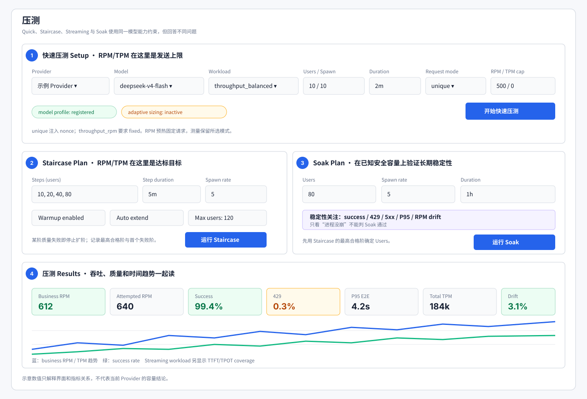

# 压测说明

返回[测试总指南](testing_guide.md)。

压测用于回答容量和稳定性问题。运行前必须先确认模型、Route、API Form 与 model profile 已注册；压测请求会应用该组合的参数约束，但不会替代完整参数矩阵。

## 选择运行模式

| 模式 | 目的 | 典型时长 | 主要结论 |
|---|---|---:|---|
| Smoke / Preflight | 最小真实请求验证鉴权、模型、请求构造和关键 profile | 分钟级 | 能否开始正式测试 |
| Quick | 固定并发或 RPM/TPM cap 下快速观察 | 1–10 分钟 | 当前设置是否安全、配置是否合理 |
| Staircase | 逐阶提高并发直到达到目标或质量失败 | 每阶数分钟 | 最高合格阶梯和目标能否达到 |
| Streaming | 等长流式请求测 TTFT/TPOT/E2E | 视样本量 | 首 token 与持续生成体验 |
| Soak | 在已知安全并发长期运行 | 默认 1 小时 | 稳态成功率、限流、延迟和吞吐漂移 |

推荐顺序是 Smoke → Quick → Staircase → Soak。不要直接用高并发 Soak 探索未知容量。



图中编号对应：① Quick 的速率上限；② Staircase 的并发阶梯与达标目标；③ Soak 的长期稳定性计划；④ 吞吐、质量、延迟和趋势结果。示意数值不代表当前供应商容量。

## Workload 预设

| Workload | 请求分布 | 适用问题 |
|---|---|---|
| `throughput_rpm` | 短、中 prompt 为主 | 最大化 RPM、验证请求调度 |
| `throughput_balanced` | 短、中、约 8k 和较长上下文混合 | 综合业务基线 |
| `throughput_tpm` | 长上下文权重更高，超限项按模型上下文过滤 | 提高 TPM、观察长输入能力 |
| `throughput_streaming` | 三个近似等长流式请求 | TTFT、TPOT、E2E 延迟 |
| `throughput` | 项目历史混合比例 | 与旧结果连续比较 |
| `mixed_compat` | 多种兼容性 profile 混合 | 诊断接口行为，不是容量基准 |

Staircase 和 Soak 只接受确定性的 `throughput*`，拒绝 `mixed_compat`。`mixed_compat` 中不同 profile 成本差异大，不能把其 business RPM 当作稳定容量。

## 请求模式与缓存污染

普通压测默认 `request_mode=unique`：在首个 user 内容前注入 nonce，降低 Provider prompt cache 对容量的虚增。

`fixed` 只用于明确研究固定请求复用的场景。若使用 fixed，应在报告中披露，因为结果不等同于真实变化请求的吞吐。

缓存机制本身应由[缓存测试](cache_testing.md)用正负控制验证，不要从压测延迟推断缓存。

## Quick 与 Staircase 的 RPM/TPM 含义不同

- **Quick**：`target_rpm` / `target_tpm` 是发送速率上限。成功和失败的尝试都会消耗 RPM 预算；TPM 先按请求估算预留，返回后再用实际 usage 校正。0 表示不限。
- **Staircase**：`target_rpm` / `target_tpm` 是达标目标，不会限制 Locust 子进程的发送速率。每阶用实际结果判断是否达到目标。

当 RPM 和 TPM 都大于 0 时，系统按 `TPM / RPM` 计算平均 token 目标，并用 0.5x / 1.0x / 1.5x 三档混合请求。实际 usage 会校正估算。请求仍受模型上下文窗口 95% 安全边界限制。

## Profile 如何影响压测请求

每条压力路径先解析：

```text
model → family → route → API Form → model profile → request
```

- 未注册模型、Route、当前 Route 下的 API Form 或 model profile 会在启动前失败。
- `pressure_profiles` 决定 `mixed_compat` 可选择的场景。
- `pressure_omit_params` 删除模型不支持或高风险的参数。
- `pressure_parameter_aliases` 把通用字段改为该模型的字段名。
- `pressure_overrides` / `pressure_transport_overrides` 固定该模型或协议需要的值。

这些保护只保证压测请求符合已知合同，不会把参数测试的错误参数带进业务流量。完整参数边界仍需先跑[参数测试](parameter_testing.md)。

## 指标口径

### 吞吐

- `attempted_business_rpm`：所有业务请求尝试，包括失败。
- `business_rpm`：成功完成的业务生成请求；排除 `/models`、warmup、retry、cache suite 和兼容性控制流量。
- `total_tpm`：根据响应 usage 汇总的总 token 吞吐；usage 缺失时覆盖率必须同时报告。

目标容量应使用 business RPM，不要用 attempted business RPM 掩盖大量失败。

### 质量

- 请求成功率。
- 429 占比和 5xx 占比。
- P50/P90/P95/P99 E2E 延迟。
- 流式请求的 TTFT、TPOT 及各自 coverage。
- 响应结构、空内容、工具流等业务失败分类。

### 稳定性

Soak 使用 `history.jsonl` 的非 warmup bucket 比较首尾窗口：

```text
business_rpm_drift
= abs(last_window_avg - first_window_avg) / first_window_avg
```

同时观察成功率、429/5xx、延迟是否随时间恶化。只有总平均值正常而后半程退化，也应判为稳定性风险。

## Staircase 怎么判

每个阶梯同时检查：

1. 成功率、延迟、429/5xx 等质量门槛。
2. `business_rpm ≥ target_business_rpm_min`。
3. 若配置 TPM 目标，`total_tpm ≥ target_total_tpm_min`。

至少一个阶梯同时满足质量和目标时，整体可通过。之后更高阶发生饱和不会推翻已经证明的合格阶梯，但报告必须保留：

- `highest_passing_step`。
- `first_failing_step`。
- 最大合格 RPM/TPM。
- 峰值尝试 RPM/TPM。
- 每阶质量失败原因。

一旦某阶质量失败，执行器停止继续扩阶。若所有已配置阶梯质量正常但尚未达目标，`auto_extend` 可按增量扩到 `max_users`。

## 如何运行

### Web 控制台

```bash
python scripts/web_console.py
```

Web 会把 Provider、Model、Route、API Form、workload、门槛和 Quick/Staircase/Soak plan 写入无密钥 `job_spec.json`。Runner 只执行该快照，便于恢复和复现。

### CLI

最小冒烟：

```bash
LOADTEST_PROVIDER=<provider> LOADTEST_MODEL=<model> python scripts/smoke_test.py
```

直接 Locust Quick：

```bash
LOADTEST_PROVIDER=<provider> \
LOADTEST_MODEL=<model> \
LOADTEST_ROUTE_PROFILE=<route> \
LOADTEST_API_FORM=<api-form> \
LOADTEST_WORKLOAD=throughput_balanced \
locust -f locustfile.py --headless -u 10 -r 2 -t 2m \
  --csv=reports/quick/run --html=reports/quick/report.html
```

Staircase 与 Soak：

```bash
LOADTEST_PROVIDER=<provider> LOADTEST_MODEL=<model> python scripts/run_staircase.py
LOADTEST_PROVIDER=<provider> LOADTEST_MODEL=<model> python scripts/run_soak.py
```

这些 runner 读取 `config.yaml`、环境变量或 `LOADTEST_JOB_SPEC`，没有 argparse `--help`。

## 结果文件

| 模式 | 默认目录 | 首先查看 |
|---|---|---|
| Quick | Web Job 或显式 `LOADTEST_REPORT_DIR` | summary、`request_records.jsonl`、Locust HTML/CSV |
| Staircase | `reports/staircase/` | `verdict.json`、`staircase_progress.json`、各 step 的 measure 目录 |
| Soak | `reports/soak_1h/` | `verdict.json`、run summary、`history.jsonl`、Locust HTML |

Web Job 统一写在 `reports/jobs/<job_id>/`，应先读 `job_spec.json` 确认本次实际配置，再读 verdict/summary，而不是根据页面记忆猜测。

## 停止和安全边界

- 先用 `/v1/models` 和最小真实请求确认鉴权与模型可达，但 `/models` 声明本身不是可用性证明。
- 参数或 identity mismatch 未解决时停止容量结论。
- Staircase 某阶出现质量失败后停止扩阶。
- 大量 429/5xx 时先降低频率定位供应商限制，不用高频重试制造更多噪声。
- 超过模型上下文安全边界的静态 profile 会被过滤；若目标 TPM 依赖这些被过滤项，应调整计划。
- 密钥不进入 Job Spec、命令参数、报告或提交。

## 常见误读

| 误读 | 正确解释 |
|---|---|
| attempted business RPM 达标，所以容量达标 | 必须看成功的 business RPM 和质量门槛 |
| Quick 的 target RPM 是目标 | Quick 中它是 cap；Staircase 中才是达标目标 |
| 平均延迟不错，所以流式体验好 | 还要看 TTFT/TPOT 和 coverage |
| 最高阶失败，所以整个 Staircase 都失败 | 若较低阶已同时满足目标和质量，应报告最高合格阶及首个失败阶 |
| 运行 1 小时没有崩溃，所以 Soak 通过 | 还需检查成功率、429/5xx、P95 和首尾吞吐漂移 |
| fixed 请求更快，所以模型容量更大 | fixed 可能命中缓存，不能与 unique 业务容量直接比较 |

## 报告措辞模板

```text
在 throughput_balanced、unique 请求模式下，Staircase 的最高合格阶为 80 users：
business RPM 612，total TPM 184k，成功率 99.4%，429 为 0.3%，P95 E2E 为 4.2s。
100 users 首次质量失败，原因是 429 占比超过门槛；attempted business RPM 790 不作为业务容量。
随后在 80 users 运行 1h Soak，首尾 business RPM 漂移 3.1%，其余质量门槛通过。
```
