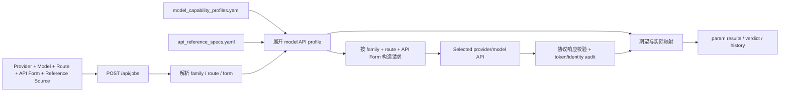

# 参数测试架构

参数测试以模型家族为第一分类，API 兼容标准只是一种 API Form，不再充当模型家族。权威配置由 `model_capability_profiles.yaml`（schema v4）与 `api_reference_specs.yaml` 共同组成。

## 分层结构

```text
modality（text / image）
  └─ model family（gpt / kimi / claude / gemini / ...）
       └─ route profile（vendor_direct / google_ai_studio / google_vertex / ...）
            └─ API form（openai_chat_completions / anthropic_messages / ...）
                 └─ model profile（该 route + API form 下的模型测试契约）
```

当前文字家族为 `deepseek`、`glm`、`qwen`、`gemini`、`claude`、`claude_fable`、`gpt`、`kimi`、`minimax`、`grok`；图片家族为 `gpt-image-2`、`banana`、`grok-imagine`。

API Form 描述公开请求协议，transport 只是内部执行适配器：

| API Form | 内部 transport | 适用范围 |
|---|---|---|
| `openai_chat_completions` | `chat_completions` | 多个文字家族及 Banana 兼容接口 |
| `openai_responses` | `openai_responses` | GPT、Grok 等 Responses 接口 |
| `anthropic_messages` | `claude_messages` | Claude / Claude Fable 原生接口 |
| `gemini_generate_content` | `gemini_generate_content` | Gemini 原生接口 |
| `openai_images_generations` | `images-generations` | GPT Image / Grok Imagine |
| `gemini_interactions` | `gemini-interactions` | Banana 原生 Interactions 接口 |

因此 `openai_chat_completions` 可以出现在 GPT、Kimi、GLM、Claude 等多个家族下面，但这些模型不会再被归入同一个 `openai` 家族。`openai_*` 仍可出现在历史 Reference Source ID 中，它只表示来源名称或 API 形态。

## 能力注册表

`model_capability_profiles.yaml` 中每个家族包含两类模型信息：

- `models`：模型的规范身份、alias、通用语义差异、压力参数策略和 evidence；
- `route_profiles.<route>.api_forms.<form>.model_profiles`：明确登记该模型能否在该 route 与 API Form 组合下执行，并记录完全匹配的 Reference Source 和期望。

同一模型若支持多个 route 或 API Form，必须在每个可执行组合的 `model_profiles` 中分别登记。例如 Gemini 2.5 Pro 的 AI Studio GenerateContent 与 Vertex GenerateContent 使用同一种协议，但仍会得到不同的 `model_api_profile_id`、参数集合和 Reference Source。

运行时按以下顺序合并：

1. family 默认；
2. canonical model 差异；
3. route 默认；
4. route 下的 API Form 默认；
5. route + form 下的 model profile；
6. provider-local override。

只有模型已注册、route 已声明、当前 route 下存在 API Form 且该组合有 model profile 时，`profile_status` 才是 `registered`。状态分为 `unregistered_model`、`unregistered_route`、`unregistered_api_form_for_route` 与 `unregistered_model_profile`；这些状态可用于只读诊断，但参数、图片、Smoke、压力和 Cache 任务都会拒绝启动。

私有或临时差异写入已忽略的 `model_capability_profiles.local.yaml`，加载时与主注册表深合并。

## Provider 路由配置

Provider 声明“某模型实际开放哪些 API Form”，而不是声明模型属于某种 API 标准：

```yaml
models:
  candidates: [gemini-2.5-pro]
  families:
    gemini-2.5-pro: gemini
  routes:
    gemini-2.5-pro:
      google_ai_studio:
        api_forms:
          gemini_generate_content: {}
      google_vertex:
        api_forms:
          gemini_generate_content: {}
  default_routes:
    gemini-2.5-pro: google_ai_studio
  default_api_forms:
    gemini-2.5-pro:
      google_ai_studio: gemini_generate_content
      google_vertex: gemini_generate_content
```

解析必须先确定 route：任务显式 route → `default_routes` → 唯一 route，否则报错；然后只在该 route 下按任务显式 form → route 默认 form → 唯一 form解析。禁止隐式回退 `dynamic_aggregator`。schema v3 和旧 provider form-first 配置仅做只读迁移，schema v4 是唯一新写格式；冲突迁移会报告字段与两条 YAML 路径并拒绝猜测。

## Reference Source 约束

`api_reference_specs.yaml` 中每个可执行来源必须精确声明：

- `model_family`：实际模型家族；
- `api_form`：请求协议；
- `route_profile`：该规范证据来自官方直连、云厂商路由或兼容层等哪类路径。

手动选择来源时会同时校验 family、route 与 API Form，不能把 AI Studio 来源用于 Vertex，也不能把 Chat Completions 矩阵用于 Responses。Configured route 与观测到的上游指纹是两类证据：指纹可以提示路由异常，但不能自动改写 configured route。

来源目录和当前各家族可执行组合见
[`model_supplier_route_catalog.md`](model_supplier_route_catalog.md)。未知代理必须保留为
`dynamic_aggregator`；不能仅凭模型家族、兼容协议或响应 `model` 字段把它归为
`vendor_direct`。动态聚合 route 只产生 adapter 兼容证据，不产生原厂 route
合同认证。

## 判定与审计

每个文字 profile 或图片 case 先按 model → family → route → API Form → model profile 解析 `supported` / `unsupported` 期望，再使用统一映射：

| 期望 | 实际结果 | 状态 | 兼容通过 |
|---|---|---|---|
| supported | 2xx 且响应校验通过 | `pass` | 是 |
| supported | 400/422 或响应校验失败 | `incompatible` | 否 |
| unsupported | 400/422 | `expected_rejection` | 是 |
| unsupported | 2xx | `unexpected_acceptance` | 否 |
| 任意 | 401/403/404/429/5xx/网络失败 | `fail` | 否 |

HTTP 2xx 还必须经过所选协议的响应语义校验，包括 JSON、流式 usage、tool call 与 follow-up、reasoning、候选数量等。兼容性、token accuracy、returned-model identity 是三个独立门禁；三者均通过才得到 `adapter_pass`。`certified_route_contract_pass` 还要求 Reference Source 的 `certification_scope` 不是 `adapter_only`；动态聚合和未固定 physical provider 的 OpenRouter 即使 adapter 通过，也不能获得原厂/云 route 合同认证。每个结果会保留 `model_family`、`route_profile`、`api_form`、`model_profile_id`、`reference_source`、认证范围、token audit 和 identity audit；历史主键包含 route 与 profile ID，不同 route 不能互相命中。

## 上游偷换排查的覆盖边界

家族化 profile 解决的是“应该按哪份契约测试”，不能单独证明物理上游。当前能力与待补项必须分开解读：

| 维度 | 当前状态 | 判定边界 / 下一步 |
|---|---|---|
| 参数兼容与返回值语义 | 已覆盖 | 每个模型在每种已开放 API Form 下有独立 profile；2xx 仍需通过 JSON、SSE、tools、usage 等响应校验。 |
| 返回 `model` / `modelVersion` | 已覆盖参数测试 | 每次任务先做 identity probe，后续响应继续采样；精确值或显式 alias 才能通过，并检测任务内漂移。字段由网关自报，因此一致只是不矛盾证据，不是物理上游证明。 |
| token 审计 | 已覆盖参数测试 | 独立精确计数器可用时参与门禁；只有字符估算时结论保持 N/A。短提示 token 异常可形成证据，但尚未为所有模型 profile 配置家族专属膨胀阈值。 |
| temperature / sampling 政策 | 部分覆盖 | Kimi K3 等有官方特殊约束的模型已用专属 profile；尚未为每个模型统一声明 `0/0.5/0.7/1` 扫描值及各值的官方期望。该基线必须放在 model API profile，不能做跨家族统一解释。 |
| 相邻型号对照、目标模型 ×3 | 未编排成单个任务 | 目前可分别运行，但不会自动把目标重复请求与相邻型号结果合成 identity 证据。应新增 family probe policy 与对照任务编排。 |
| 响应 ID、节点 hash、SSE 结构、错误语料、网关头 | 尚未进入参数门禁 | `lib/upstream_fingerprint.py` 仍是未校准初稿，不能作为自动 PASS/FAIL。完成异常隔离、正则修复、单测和官方基线后，只先输出可疑度与相似度，不直接断言上游。 |
| Cache 正负控制与 usage 真实性 | 已覆盖 Cache Suite | 正控 cold→warm、负控唯一前缀和 telemetry 算术已是硬约束；Cache Suite 仍需复用同一 identity envelope，保证每条 `request_records.jsonl` 都保存 requested/returned model 与指纹摘要。 |
| `GET /v1/models` | 仅可用性辅助证据 | 模型清单是声明，不是执行身份；应保留命名风格和邻近型号信息，但不得替代真实请求的 identity audit。 |

后续按以下顺序闭环：

1. 在每个 model API profile 增加 `probe_policy`，声明重复次数、邻近对照模型、sampling 扫描、短提示 token 阈值、官方 usage/cache 字段与合法 identity alias。
2. 把统一 identity envelope 接到 Param、Cache、Smoke 和压力记录，至少保存 requested/returned model、response ID 前缀、白名单响应头、API Form、route 和任务内漂移。
3. 修订并测试上游指纹采集器，以官方 API 和已知同源/异源渠道校准语料与权重；指纹结果先作为 `suspicious` 证据，不能覆盖字段级 `mismatch`。
4. 新增家族探测任务：`GET /models` → 目标模型 ×3 → 相邻型号 → sampling 扫描 → 短提示 token 审计 → 仅重放失败用例，并把瞬时故障与稳定不兼容分开。
5. Cache Suite 复用 identity/fingerprint envelope 后，再允许缓存 verdict 与具体模型身份绑定，避免“缓存通过但实际测试了被替换模型”的历史漏洞。

## 运行时数据流



## 代码入口

| 职责 | 位置 |
|---|---|
| Provider 的 family/route/form 解析与校验 | `lib/config.py` |
| Reference Source 与能力 profile 展开 | `lib/reference_specs.py` |
| 请求构建及压力参数策略 | `lib/deepseek_params.py` |
| 文字参数测试 | `scripts/param_test.py` |
| 图片能力 overlay 与判定 | `lib/image_validation.py`、`scripts/image_param_test.py` |
| 任务创建、历史恢复和控制台 registry | `scripts/web_console.py` |
| 响应语义校验 | `lib/profile_validation.py` |
| 兼容状态映射 | `lib/param_outcome.py` |
