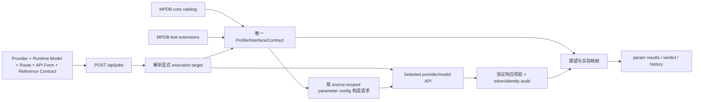

# 参数测试架构

参数测试的当前事实唯一默认作者源是 `packages/model-profile-db/` 中的 MPDB
schema 3 / catalog 0.4.0。API 兼容标准只是 Interface 上的 API Form，不是模型
家族或 source。app facade 已移除旧 YAML path reader、schema migration 和
normalization fallback；冻结输入只供仓库迁移工具复现，不属于 app 当前解析路径。

## 参数任务控制快照

新文字参数 JobSpec 使用 schema 5，冻结 `parameter_execution.runs` 与 `tool_validation_mode`。
启动读取落盘值，runner 在 API 客户端创建前拒绝矛盾环境覆盖；结果与控制值不符不能标为当前通过。
历史 schema 1–4 不补造控制值，其原判读保留并标记 `legacy_unfrozen`。
图片和压力任务继续使用 schema 4。普通 profile 正文和输入样本的完整重放仍待核实。
见[执行控制说明](parameter_job_controls_20260909.md)。
参数任务的日期快照身份也从同一份已解析或冻结的MPDB Interface读取。
当前精确官方OpenAI Responses来源与模型可使用已登记的日期别名；校验期间不查询当前目录改写旧快照，
未知endpoint或其它来源不能借用映射。原显式provider identity_aliases保持兼容。

## 分层结构

```text
modality（text / image / video）
  └─ official source
       └─ model family
            └─ concrete official model / Profile
                 └─ Interface（API Form + official route contract）
                      └─ Contract + Test Binding
```

运行时执行目标是另一个独立边界：`provider + runtime model + route + API Form`。
它可以显式绑定到上述 source-scoped Profile/Interface，但不能改写官方 source 或
Contract 身份。

显式固定参数套件沿 `parameter_suite` 与原有不可变 JobSpec 执行。Anthropic 缓存套件的共享定义只存一份正文模板；
创建任务时冻结两个 nonce 和完整五个请求体到 `fixed_parameter_plan`，预览与读取历史不随机化。
受限 transport 只允许两个 count 请求走 `/v1/messages/count_tokens`，随后三个生成走 `/v1/messages`；
计数保留官方估算资格，跳过生成输出 floor 与生成 token 审计。详见[缓存固定套件](anthropic_cache_reference.md)。

当前文字家族为 `deepseek`、`glm`、`qwen`、`gemini`、`claude`、`claude_fable`、`gpt`、`kimi`、`minimax`、`grok`；图片家族为 `gpt-image-2`、`banana`、`grok-imagine`。

API Form 描述公开请求协议，transport 只是内部执行适配器：

| API Form | 内部 transport | 适用范围 |
|---|---|---|
| `openai_chat_completions` | `chat_completions` | 多个文字家族及 Banana 兼容接口 |
| `openai_responses` | `openai_responses` | GPT、Grok 等 Responses 接口 |
| `anthropic_messages` | `claude_messages` | Claude / Claude Fable 原生接口 |
| `gemini_generate_content` | `gemini_generate_content` | Gemini 原生接口 |
| `openai_images_generations` | `images-generations` | GPT Image / Grok Imagine |
| `gemini_interactions` | `gemini-interactions` | Banana 原生 Interactions 接口 |

因此 `openai_chat_completions` 可以出现在 GPT、Kimi、GLM、Claude 等多个家族下面，但这些模型不会再被归入同一个 `openai` 家族。`openai_*` 仍可出现在历史 Reference Contract ID 中，它只表示旧合同名称或 API 形态。

## MPDB 参数绑定

每个参数配置必须在同一份 MPDB 中唯一解析为：

- `source_id + profile_id + interface_id`：官方来源、精确模型与 API Form/路由合同；
- `contract_id`：该 source 下定义参数与响应语义的单一 Contract；
- `test_binding_id`：将 suite/context 与 Interface/Contract 确定性绑定的扩展对象。

同一 Interface 有多个合法 Binding 时，必须由显式 suite/context 消歧；
`identity_only`、disabled、retired 或 not-certified 对象不得被提升为可执行参数配置。
wrong modality/source/family/model/interface/API Form/Binding/Contract 一律 fail closed，同名模型也
不允许跨 modality 或跨 source 解析。

当前候选中的 Source、canonical model、Profile、Interface、Contract 和 Test Binding 均
有 source-local provenance；参数 Contract/Test Binding 各自只能有一个 `source_id`。
运行时 Provider override 只能调整执行目标，不能合并、覆盖或伪造 MPDB 参数事实。
本批迁移未读取 private overlay。

## Provider 路由配置

Provider 声明“某模型实际开放哪些 API Form”，而不是声明模型属于某种 API 标准：

```yaml
models:
  candidates: [gemini-2.5-pro]
  families:
    gemini-2.5-pro: gemini
  routes:
    gemini-2.5-pro:
      google_ai_studio:
        api_forms:
          gemini_generate_content: {}
      google_vertex:
        api_forms:
          gemini_generate_content: {}
  default_routes:
    gemini-2.5-pro: google_ai_studio
  default_api_forms:
    gemini-2.5-pro:
      google_ai_studio: gemini_generate_content
      google_vertex: gemini_generate_content
```

执行目标必须先确定 route：任务显式 route → `default_routes` → 唯一 route，否则报错；
然后只在该 route 下按任务显式 form → route 默认 form → 唯一 form 解析。禁止隐式
回退 `dynamic_aggregator`。这里的旧 provider routing schema v3/v4 是运行配置的历史
版本，与当前 MPDB schema 3 不是同一类 schema。旧 form-first provider 配置仅限显式只读
迁移；冲突必须报告精确字段和来源路径，不得猜测。

## Source 与 Reference Contract 约束

MPDB 中每个可执行参数 Binding 必须精确声明：

- `source_id`、`profile_id` 与 `interface_id`：官方来源、精确模型和 API 接口；
- `contract_id`：与 Interface/API Form 一致的 source-local 参数合同；
- `suite` / `context`：同一 Interface 存在多个 Binding 时的显式消歧键；
- provenance：authority/domain、official URL、检索日期、exact identity、API Form/
  parameter/section 与内容版本都来自同一 `source_id`。

手动选择来源时会同时校验 modality、source、family、model、Interface、API Form、
Binding 和 Contract，不能把 AI Studio 来源用于 Vertex，也不能把 Chat Completions
矩阵用于 Responses。Configured route 与观测到的上游指纹是两类证据：指纹可以提示
路由异常，但不能自动改写 configured route 或 MPDB source。

来源目录和当前各家族可执行组合见
[`model_supplier_route_catalog.md`](model_supplier_route_catalog.md)。未知代理必须保留为
`dynamic_aggregator`；不能仅凭模型家族、兼容协议或响应 `model` 字段把它归为
`vendor_direct`。动态聚合 route 只产生 adapter 兼容证据，不产生原厂 route
合同认证。

## 判定与审计

每个文字 profile 或图片 case 先按已绑定的 source → Profile → Interface → Contract →
Test Binding 解析 `supported` / `unsupported` 期望，执行目标则独立保留
provider/model/route/API Form，再使用统一映射：

| 期望 | 实际结果 | 状态 | 兼容通过 |
|---|---|---|---|
| supported | 2xx 且响应校验通过 | `pass` | 是 |
| supported | 400/422 或响应校验失败 | `incompatible` | 否 |
| unsupported | 400/422 | `expected_rejection` | 是 |
| unsupported | 2xx | `unexpected_acceptance` | 否 |
| 任意 | 401/403/404/429/5xx/网络失败 | `fail` | 否 |

HTTP 2xx 还必须经过所选协议的响应语义校验，包括 JSON、流式 usage、tool call 与
follow-up、reasoning、候选数量等。兼容性、token accuracy、returned-model identity 是三个
独立门禁；三者均通过才得到 `adapter_pass`。`certified_route_contract_pass` 还要求
Binding 的 `certification_scope` 不是 `adapter_only`；动态聚合和未固定 physical provider 的
OpenRouter 即使 adapter 通过，也不能获得原厂/云 route 合同认证。每个结果保留
`source_id`、`profile_id`、`interface_id`、`contract_id`、`test_binding_id` 以及执行目标的
provider/model/route/API Form、认证范围、token audit 和 identity audit；历史主键包含
route 与 Profile/Interface/Binding ID，不同 source 或 route 不能互相命中。

## 上游偷换排查的覆盖边界

家族化 profile 解决的是“应该按哪份契约测试”，不能单独证明物理上游。当前能力与待补项必须分开解读：

| 维度 | 当前状态 | 判定边界 / 下一步 |
|---|---|---|
| 参数兼容与返回值语义 | 已覆盖 | 每个模型在每种已开放 API Form 下有独立 profile；2xx 仍需通过 JSON、SSE、tools、usage 等响应校验。 |
| 返回 `model` / `modelVersion` | 已覆盖参数测试 | 每次任务先做 identity probe，后续响应继续采样；精确值或显式 alias 才能通过，并检测任务内漂移。字段由网关自报，因此一致只是不矛盾证据，不是物理上游证明。 |
| token 审计 | schema v4 覆盖 identity/initial/follow-up、图片 case 和每次重试 | 强制 input/output usage、算术、有界数量与所有候选的输出完成证据；媒体/隐藏上下文缺独立计数时未验证并阻断，旧 schema 不再视为当前通过。 |
| temperature / sampling 政策 | 部分覆盖 | Kimi K3 等有官方特殊约束的模型已用专属 profile；尚未为每个模型统一声明 `0/0.5/0.7/1` 扫描值及各值的官方期望。该基线必须放在 model API profile，不能做跨家族统一解释。 |
| 相邻型号对照、目标模型 ×3 | 未编排成单个任务 | 目前可分别运行，但不会自动把目标重复请求与相邻型号结果合成 identity 证据。应新增 family probe policy 与对照任务编排。 |
| 响应 ID、节点 hash、SSE 结构、错误语料、网关头 | 尚未进入参数门禁 | `lib/upstream_fingerprint.py` 仍是未校准初稿，不能作为自动 PASS/FAIL。完成异常隔离、正则修复、单测和官方基线后，只先输出可疑度与相似度，不直接断言上游。 |
| Cache 正负控制与 usage 真实性 | 已覆盖 Cache Suite | 正控 cold→warm、负控唯一前缀和 telemetry 算术已是硬约束；Cache Suite 仍需复用同一 identity envelope，保证每条 `request_records.jsonl` 都保存 requested/returned model 与指纹摘要。 |
| `GET /v1/models` | 仅可用性辅助证据 | 模型清单是声明，不是执行身份；应保留命名风格和邻近型号信息，但不得替代真实请求的 identity audit。 |

后续按以下顺序闭环：

1. 在每个 model API profile 增加 `probe_policy`，声明重复次数、邻近对照模型、sampling 扫描、短提示 token 阈值、官方 usage/cache 字段与合法 identity alias。
2. 把统一 identity envelope 接到 Param、Cache、Smoke 和压力记录，至少保存 requested/returned model、response ID 前缀、白名单响应头、API Form、route 和任务内漂移。
3. 修订并测试上游指纹采集器，以官方 API 和已知同源/异源渠道校准语料与权重；指纹结果先作为 `suspicious` 证据，不能覆盖字段级 `mismatch`。
4. 新增家族探测任务：`GET /models` → 目标模型 ×3 → 相邻型号 → sampling 扫描 → 短提示 token 审计 → 仅重放失败用例，并把瞬时故障与稳定不兼容分开。
5. Cache Suite 复用 identity/fingerprint envelope 后，再允许缓存 verdict 与具体模型身份绑定，避免“缓存通过但实际测试了被替换模型”的历史漏洞。

## 运行时数据流



## 代码入口

| 职责 | 位置 |
|---|---|
| Provider 的 family/route/form 解析与校验 | `lib/config.py` |
| Provider 执行目标与 MPDB binding 严格解析 | `lib/model_profile_catalog.py` |
| MPDB Contract/Test Binding 的 Param Spec 兼容视图 | `lib/reference_specs.py` |
| 请求构建及压力参数策略 | `lib/deepseek_params.py` |
| 文字参数测试 | `scripts/param_test.py` |
| 图片能力 overlay 与判定 | `lib/image_validation.py`、`scripts/image_param_test.py` |
| 任务创建、历史恢复和控制台 registry | `scripts/web_console.py` |
| 响应语义校验 | `lib/profile_validation.py` |
| 兼容状态映射 | `lib/param_outcome.py` |
