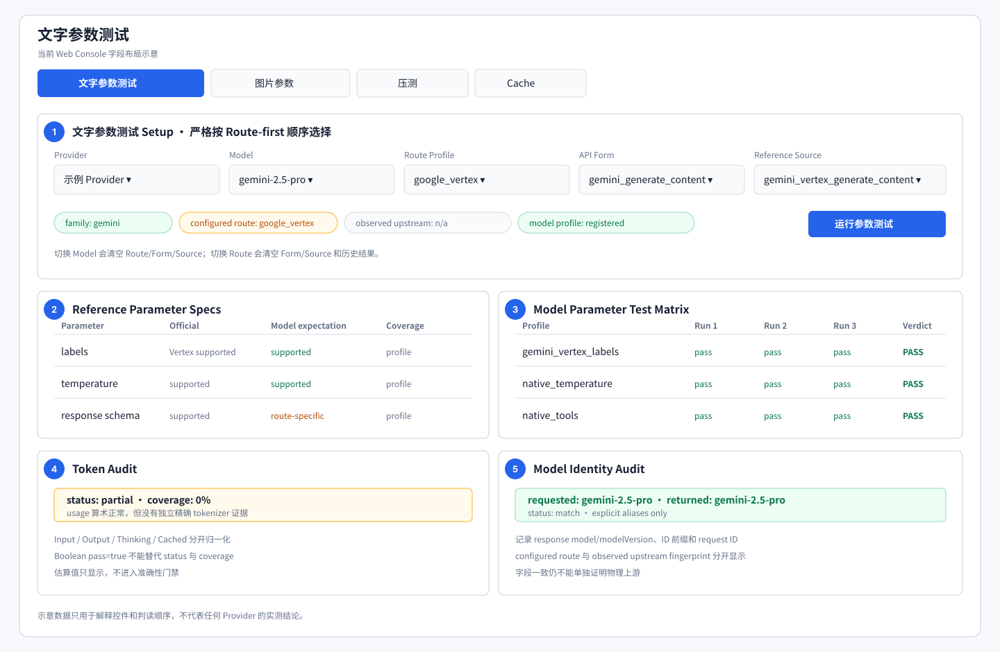
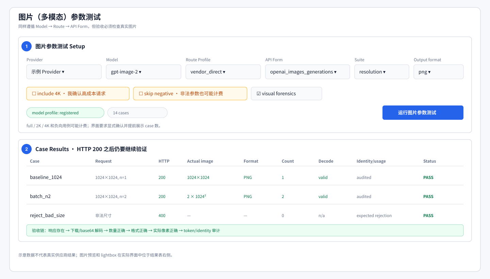

# 参数测试说明

返回[测试总指南](testing_guide.md)。

参数测试验证的是一个精确组合：

```text
模型身份 + Route Profile + API Form + Model Profile + Reference Source
```

它不只检查请求有没有返回 2xx，还检查参数实际效果、响应结构、工具调用、结构化输出、usage、returned-model identity 以及预期拒绝行为。

## 先确定测试对象

控制台选择顺序为：

```text
Provider → Model → Route Profile → API Form → Reference Source
```

解析时先确定 Route，再列出该 Route 下允许的 API Form。Reference Source 必须同时匹配 `model_family`、`route_profile`、`api_form`。任何一项不匹配都应在任务启动前报错，不能回退到家族级通用矩阵。

能力注册路径是：

```text
modality
└── family
    ├── models
    └── route_profiles
        └── <route>
            └── api_forms
                └── <form>
                    └── model_profiles
                        └── <model>
```

Profile ID 同时包含 Route 和 API Form，例如：

```text
gemini/gemini-2.5-pro@google_vertex/gemini_generate_content
```

同模型、同 API Form、不同 Route 的 ID 和历史结果必须不同。



图中编号对应：① Route-first 设置；② 官方参数与模型期望；③ 三轮参数矩阵；④ Token Audit；⑤ Model Identity Audit。示意值仅解释阅读顺序，不代表某个供应商的实测结果。

## 一个 Profile 到底测什么

一个 profile 是一个可复现的参数场景，而不是参数名称列表。例如：

- `basic_stream`：发送流式请求，校验 SSE chunk、结束标记和拼接文本。
- `stream_with_usage`：除流式结构外，还要求末块包含可用 usage。
- `json_output`：发送结构化输出参数，并确认内容能解析为 JSON。
- `tool_choice_required`：要求模型产生合法工具调用，不接受只返回普通文本。
- `stop_sequences`：确认停止序列实际控制结束位置，或按该模型合同被明确拒绝。
- `gemini_vertex_labels`：只用于 Vertex Route，验证 Vertex 专属字段和可观察指纹。

每个家族的所有现行 profile、请求设置、期望和响应检查都在[模型家族 Profile 手册](model_profiles/README.md)中逐项列出。

## 期望与结果状态

| Profile 期望 | 正常结果 | 异常结果 |
|---|---|---|
| `supported` | HTTP 2xx，且结构和语义校验通过，记为 `pass` | 400/422 为 `incompatible`；2xx 但语义不成立也失败 |
| `unsupported` | 明确的 400/422，记为 `expected_rejection`，计入兼容通过 | 仍返回 2xx 为 `unexpected_acceptance`；伪装 5xx 不算正确拒绝 |

429、502、连接超时等应归为上游瞬时故障或可用性问题。重放只针对失败 profile，低频重试后再区分“稳定不兼容”和“瞬时失败”，不能用整套重跑掩盖首轮故障。

## 四层判定

### 1. 参数与响应语义

`compatibility_pass` 要求：

- 请求字段在当前 API Form 的正确位置。
- 应支持项得到 2xx，应拒绝项得到明确的客户端错误。
- 文本不是空壳；JSON 可解析且满足 schema。
- `n`/candidate count、stop、logprobs、reasoning 等返回值与请求相符。
- 工具场景产生合法调用，并完成真实 tool result follow-up。
- 流式响应可完整拼接，要求 usage 时末块确实存在。

只看“输入字段已接受”和 HTTP 状态不够。模型吞掉参数、固定采样值、返回 Markdown 围栏而不是 JSON、声明工具却没有 tool call，都应在语义校验中暴露。

### 2. Returned-model identity

矩阵前会先发送低成本 identity probe，随后每个 initial/follow-up/candidate 都作为身份样本：

- 默认要求响应顶层 `model` 或 Gemini `modelVersion` 与请求精确一致。
- 官方快照名、命名空间名等合法差异必须在 `identity_aliases` 显式登记。
- 任务内返回身份漂移会被汇总。
- `mismatch` 阻断；`suspicious` 告警；没有字段时为 `unverifiable`。

同时记录响应 ID 前缀、request ID、headers 和上游指纹用于溯源。字段一致仍不能 100% 证明物理上游，因为网关可以伪造字段；因此报告会保留这一限制。同理，`model_identity_pass=true` 但 status 为 `unverifiable` 只表示没有确认 mismatch，不等于身份已证实。

### 3. Token accuracy

Token 审计先统一 usage 为 input/output/answer/thinking/image/cached/total，再检查：

- 所有值非负。
- `input + output = total` 等算术关系成立。
- answer/thinking 等子项没有重复累计。
- cached tokens 没有超过 input 或可复用前缀。

只有精确 tokenizer、tokenizer JSON 或 count-token 接口才能把相应维度记为 exact 并参与准确性 PASS/FAIL。字符估算只是参考；`coverage=0` 或 partial 表示“没有独立计数证据”，不能写成 token 已通过。为兼容“只阻断已确认 mismatch”的门禁，`token_accuracy_pass=true` 可能与 N/A/partial 同时出现，必须连同 `token_audit_summary.status` 和 `coverage` 阅读。

### 4. Route 认证范围

- `raw_route_contract`：配置 Route 与 Reference Source 是明确厂商/云入口，测试可以判定该 Route 合同。
- `adapter_only`：动态聚合或物理上游未固定，只能说明当前适配器接受这些请求。

因此需要同时读 `adapter_pass` 和 `certified_route_contract_pass`。动态聚合结果全部通过时，后者仍应为 false。

## 运行方法

推荐从 Web 控制台运行，因为它会按 Route-first 顺序限制可选项并保存无密钥 Job Spec：

```bash
python scripts/web_console.py
```

直接 CLI 适合复现当前配置中的组合：

```bash
LOADTEST_PROVIDER=<provider> \
LOADTEST_MODEL=<model> \
LOADTEST_ROUTE_PROFILE=<route> \
LOADTEST_API_FORM=<api-form> \
LOADTEST_REFERENCE_SOURCE=<source> \
python scripts/param_test.py
```

默认每个文字 profile 运行 3 轮。不要向脚本传 `--help`：该脚本是环境变量驱动的执行器，不是 argparse 命令。图片模型使用独立执行器，具体命令见[图片参数测试专项手册](image_param_test.md)。

## 结果阅读顺序

先查看当前 Job 或 `reports/param_tests/<provider>/<model>/` 下的：

1. `verdict.json`：总体和四层门禁、来源元数据、失败分类。
2. `model_identity.json`：requested/returned/allowed identity、漂移和指纹证据。
3. 逐 profile 结果：每轮状态、HTTP、语义校验、usage、token audit。
4. 原始请求/响应摘要：只用于定位，敏感 header 会被脱敏。

报告建议写成：

```text
兼容性：18/18 profiles × 3 轮通过。
身份：所有 67 个 exchange 与请求模型精确一致；未发现任务内漂移。
Token：usage 算术 67/67 一致；独立 tokenizer 覆盖 0%，准确性结论为 partial。
Route：dynamic_aggregator，因此 adapter_pass=true，route contract 未认证。
```

不要只写“参数测试通过”。

## 文字与图片的差异

文字测试关注流式、JSON、stop、sampling、reasoning、工具、多轮和 usage。图片测试还必须：

- 解码每个输出，而不是只接受 URL/base64 字符串。
- 核对返回数量、实际格式和实际像素。
- 区分模型 alias 控制分辨率和 body 参数控制分辨率。
- 对非法尺寸、比例、数量或分辨率验证明确拒绝。

图片接口返回 HTTP 200 但图片无法解码、数量不符或像素不符，均为失败。



图片界面先选择 Route、API Form 和 Suite，再显式确认可能产生额外费用的 2K/4K 或负向用例；结果表必须继续核对解码、数量、格式、实际像素、usage 和 identity。

## 新增模型或调整 Profile

1. 在 `model_capability_profiles.yaml` 的正确 family 下登记 canonical model 和 alias。
2. 在正确 Route 下登记 API Form；不要把第三方聚合器写成厂商直连 Route。
3. 为每个可执行 `route + api_form + model` 组合显式登记 model profile。
4. 在 `api_reference_specs.yaml` 登记完全匹配 family/route/form 的 Reference Source 和官方资料。
5. 在 `config.yaml` 增加或复用可执行 profile 请求模板。
6. 添加能力解析、期望、请求构造、响应校验和跨 Route 隔离测试。
7. 重新生成并检查家族手册：

```bash
python scripts/generate_test_docs.py
python scripts/generate_test_docs.py --check
```

## 模型家族手册

当前全部文字和图片家族见[模型家族 Profile 手册索引](model_profiles/README.md)。这些文件从 schema 生成，表格不应手工修改；如果说明不对，应修正 schema、生成逻辑或公共中文释义后重新生成。
