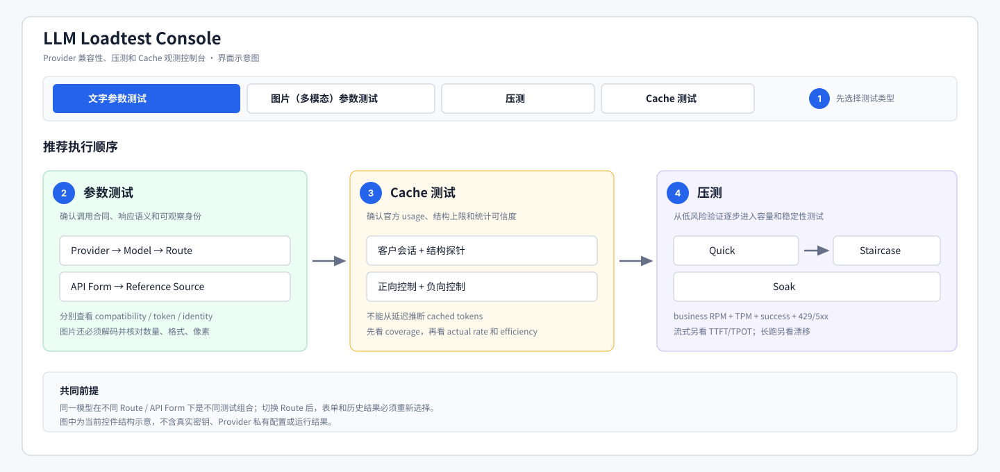

# 测试总指南

这份文档是项目的阅读入口。先根据问题选择测试，不要把“参数能用”“缓存有效”和“高并发稳定”混成一个结论。

## 三类测试分别回答什么

| 测试 | 回答的问题 | 不能单独证明 | 主要结果 |
|---|---|---|---|
| [参数测试](parameter_testing.md) | 这个模型经这条 Route、这种 API Form 调用时，参数是否按契约接受或拒绝，响应值是否正常，身份和 token 上报是否可信？ | 缓存命中率、容量上限、长时间稳定性 | `verdict.json`、`model_identity.json`、逐 profile 结果 |
| [缓存测试](cache_testing.md) | 真实增长会话中是否存在可复用前缀，上游是否如实上报 cached tokens，正负控制是否成立？ | 高并发吞吐、所有参数兼容 | `cache_results.json`、`verdict.json`、`request_records.jsonl` |
| [压测](load_testing.md) | 在指定并发、RPM/TPM 或持续时间下，成功率、吞吐、延迟、限流和稳定性怎样？ | 单个边界参数的合同完整性、缓存字段真实性 | Quick/Staircase/Soak summary、history、Locust 报告 |

推荐执行顺序：

1. 参数测试先确认调用合同、响应语义和模型身份。
2. 缓存测试确认官方 usage 和缓存控制组可信。
3. Quick 用低成本流量验证压测配置。
4. Staircase 寻找满足质量门槛的容量阶梯。
5. Soak 在已知安全并发上验证长期稳定性。

参数测试或身份门禁失败时，不应继续用该组合做容量结论；缓存测试失败不会自动否定普通无缓存吞吐，但不能再宣称缓存有效。

## 五个核心名词

项目采用 Route-first 模型能力结构，选择链路固定为：

```text
Provider → Model → Route Profile → API Form → Model Profile / Reference Source
```

- **Provider**：提供 base URL、鉴权和可售模型的服务商配置。
- **Model Family**：模型属于谁，例如 GPT、Gemini、Claude、DeepSeek。`openai` 是 API 兼容标准，不是模型家族。
- **Route Profile**：请求从哪里进入并采用哪套上游规则，例如 `google_ai_studio`、`google_vertex`、`aliyun_maas`、`vendor_direct`、`dynamic_aggregator`。
- **API Form**：请求使用什么协议，例如 Chat Completions、Responses、Anthropic Messages、Gemini GenerateContent。
- **Model Profile**：某个“模型 + Route + API Form”组合具体支持、拒绝或改写哪些参数，以及需要运行哪些测试。

同一个 Gemini 模型即使都使用 GenerateContent，AI Studio 和 Vertex 仍是两个 Route，参数与 Reference Source 可以不同，结果也不能串用。`dynamic_aggregator` 只表示未固定物理上游；返回的 `model` 字段相同不能把它升级成厂商直连。

## 五分钟开始

```bash
python scripts/web_console.py
```

打开 `http://127.0.0.1:8090/` 后：

1. 选择 Provider 和 Model。
2. 选择 Route Profile；切换 Route 后应重新选择 API Form 和 Reference Source。
3. 先运行“文字参数测试”或“图片参数测试”。
4. 查看兼容性、token accuracy、returned-model identity 三个独立状态。
5. 参数合同成立后运行 Cache；确认正向控制有增长、负向控制接近零。
6. 先跑 Quick，再依据目标选择 Staircase 或 Soak。



图中编号对应：① 选择测试标签；② 先用参数测试确认合同和身份；③ 用独立控制组验证缓存；④ 再进入 Quick、Staircase 和 Soak。图为当前控件结构示意，不包含真实密钥和运行数据。

密钥只能放在 `.env` 或已忽略的 `providers.local.yaml` 所引用的环境变量中。不要把密钥写进命令、报告、Job Spec 或提交内容。

## 如何读结果，不被顶层 PASS 误导

### 参数测试

至少分别看：

- `compatibility_pass`：应支持的 profile 成功，应拒绝的 profile 明确拒绝，响应结构和语义校验通过。
- `token_accuracy_pass` 及其 `status/coverage`：Boolean 为 true 可能只表示“未发现精确 mismatch”；没有独立计数覆盖时仍是 partial/N/A，不代表计数已证实。
- `model_identity_pass` 及其 `status`：响应 `model` / `modelVersion` 与请求或显式 alias 一致；Boolean 为 true 但 status 为 `unverifiable` 时，身份仍未得到证明。
- `adapter_pass` 与 `certified_route_contract_pass`：动态聚合即使协议全过，也通常只有 adapter pass。

示例：`54/54 compatibility pass`、所有 returned model 精确一致，但本地 token 计数覆盖为 0，应写成“参数兼容和可观察身份通过；token audit 仅完成 usage 算术检查，独立准确性未证实”，不能简写成“全部可信”。

### 缓存测试

按以下顺序读：

1. 客户场景请求成功率与会话完成率。
2. `cache_measurement_coverage` 是否足够。
3. 正向控制 cold→warm 是否出现 cached token 增长。
4. 负向控制唯一前缀是否维持低命中。
5. `structural_hit_rate_ceiling`、`actual_cache_hit_rate`、`cache_efficiency` 是否相互合理。
6. `cache_usage_accuracy_status` 是否存在超报或算术矛盾。

延迟变快不能替代官方 cache usage 证据。

### 压测

至少同时看：

- `attempted_business_rpm` 与 `business_rpm`，后者只统计成功业务生成。
- 总 TPM、成功率、429/5xx 比例。
- E2E 延迟；流式 workload 还要看 TTFT/TPOT 覆盖率。
- Staircase 的 `highest_passing_step` 和 `first_failing_step`。
- Soak 首尾窗口吞吐漂移和时间序列。

Quick 中 RPM/TPM 是发送上限；Staircase 中是达标目标，两者含义不同。

## 文档导航

- [参数测试完整说明](parameter_testing.md)
- [缓存测试完整说明](cache_testing.md)
- [压测完整说明](load_testing.md)
- [全部模型家族 Profile 手册](model_profiles/README.md)
- [Route 与供应商目录](model_supplier_route_catalog.md)
- [参数测试架构与代码入口](param_test_architecture.md)
- [图片参数测试专项手册](image_param_test.md)

## 配置或新增模型后的维护

修改模型能力或 Reference Source 后运行：

```bash
python scripts/generate_test_docs.py
python scripts/generate_test_docs.py --check
```

第一条从当前 schema 重新生成所有家族手册；第二条只检查，不修改文件。新增家族、Reference Source、文字 profile 或图片 case 后若说明缺失，检查应失败。
