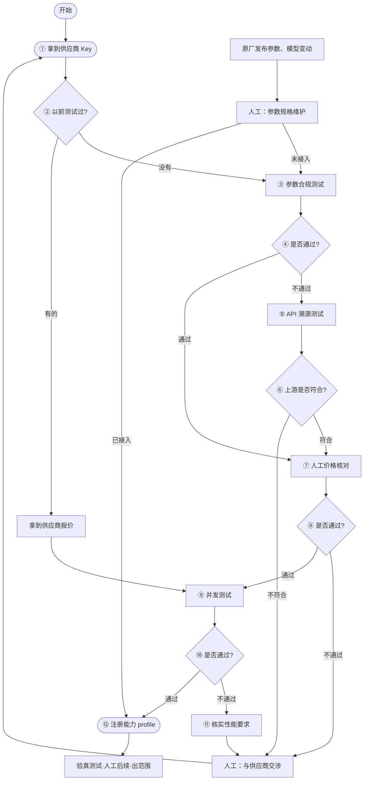

# 供应商准入工作流

本文件是 `app/workflow.yaml` 的人类可读版。状态机以 **provider + model** 为实例粒度，
实例状态存于 `$DATA/workflows/<provider>__<model>.json`，因此可以随时中断、随时由
openclaw 中途接手（`workflow.py status`）。

## 流程图

## 节点 → 实现映射

| 节点 | workflow.yaml id | 类型 | 实现 |
|---|---|---|---|
| ① 拿 Key | `acquire_key` | human_gate | 协助写 `$DATA/.env` + `providers.local.yaml`（需用户批准） |
| ② 以前测试过? | `check_history` | decision(auto) | 查 workflows 历史 + reports 中该 provider+model 的 verdict |
| ③ 参数合规 | `param_test` | auto_test | `run_test.py --type param_test` |
| ④ 判定 | `param_decision` | decision(auto) | verdict.pass |
| ⑤ API 溯源 | `trace_test` | auto_test | `run_test.py --type trace_test --expect <宣称上游>`；判定 token 真实上游（官方/AWS/Vertex…） |
| ⑥ 判定 | `trace_decision` | decision(auto) | verdict.match_expected |
| ⑦ 价格核对 | `price_check` | human_gate | 用户核对报价后给 pass/fail |
| 报价（已测过路径） | `supplier_quote` | human_gate | 记录报价后进并发 |
| ⑨ 并发 | `concurrency_test` | auto_test | `run_test.py --type staircase` |
| ⑩ 判定 | `concurrency_decision` | decision(auto) | verdict.pass |
| ⑪ 核实性能要求 | `verify_perf_requirements` | human_gate | 记录结论 → 交涉 |
| 交涉 | `negotiate` | human_gate | 回到 ① |
| 参数规格维护 | `profile_maintenance` | human_gate | `--entry profile_maintenance` 进入；not_onboarded→③ / onboarded→⑫ |
| ⑫ 注册 profile | `onboard` | onboard | `onboard-propose` 生成 v4 YAML → **人工批准** → `onboard-apply --yes` 写入 `$DATA/model_capability_profiles.local.yaml`（自动备份 .bak） |
| 验真 | — | 出范围 | 人工后续事项，本 skill 不自动化 |

## 中途接手示例

1. `workflow.py list` 找到进行中的实例；
2. `workflow.py status --provider P --model M` 看当前节点、历史、待办；
3. 按节点类型执行（见 SKILL.md），`advance` 推进。

## 溯源语料库

trace_test 需要 `$DATA/upstream_fingerprints.json` 里有已知上游参考指纹
（用官方/云厂商直连 key 通过 `trace_test.py collect --save-upstream` 采集）。
语料为空时 compare 直接报错——这是刻意设计，避免“空库误判上游”。
